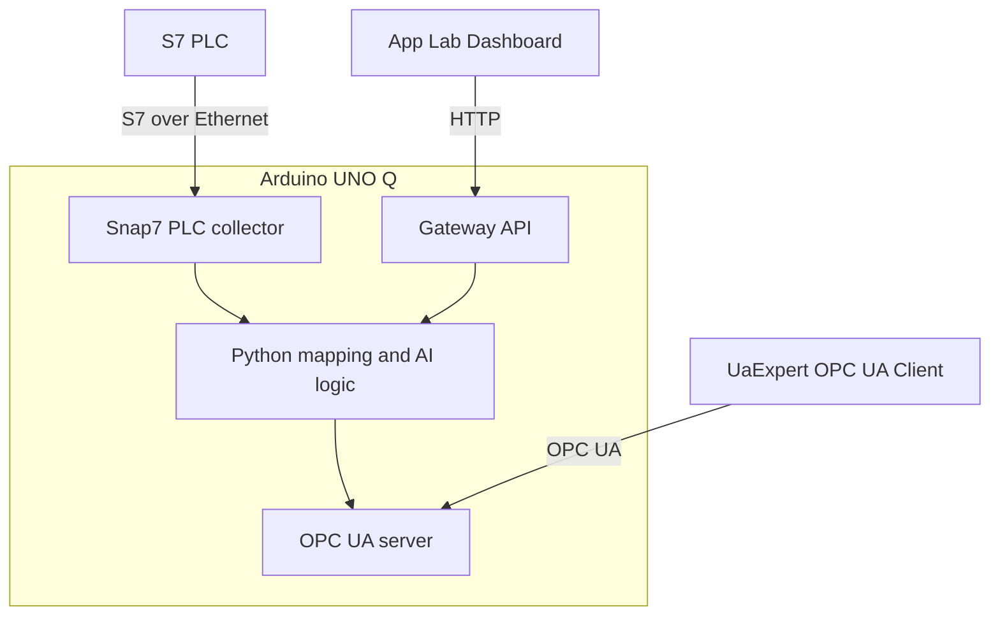
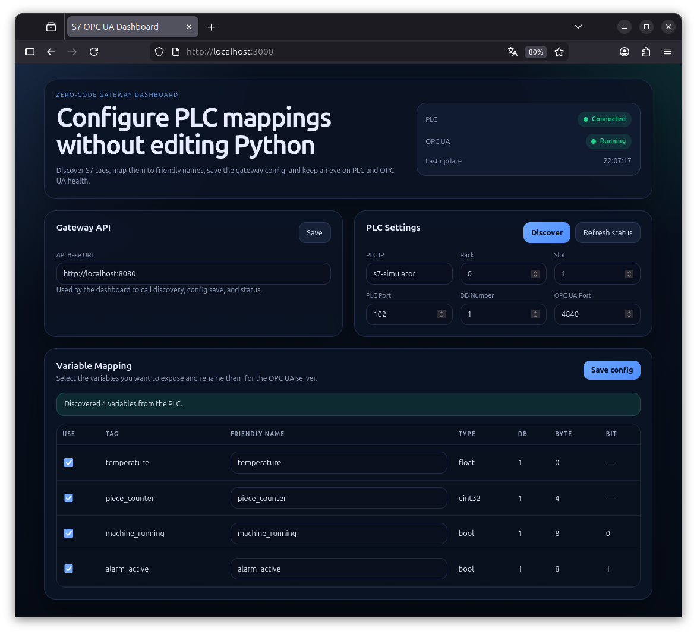
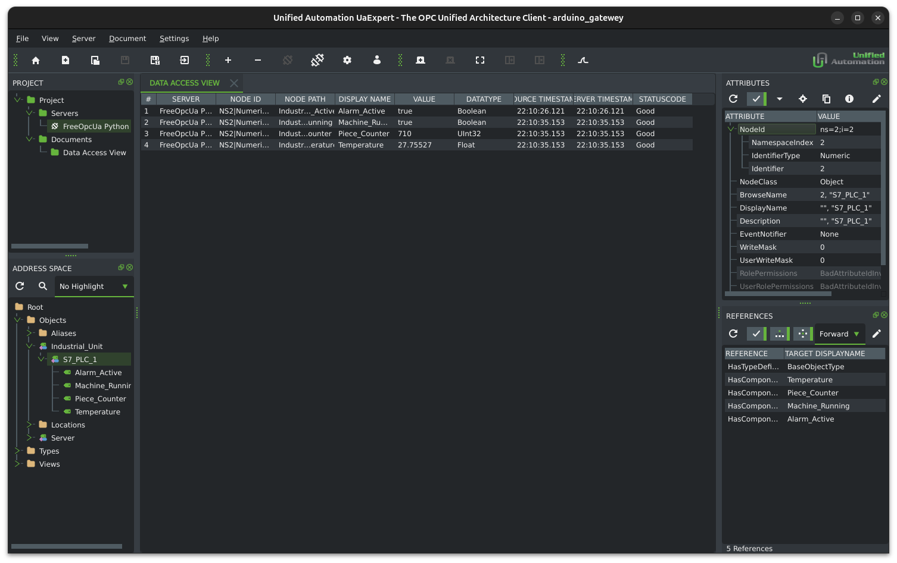

# s7-opcua-bridge
Industrial S7-to-OPCUA Edge Gateway

## Overview

An open-source edge gateway that reads data from Siemens S7 PLCs and exposes
it through an OPC UA server. The project now supports both local IDE runs and
containerized deployment so the simulator and gateway can be isolated cleanly.

## Visual Overview

### Data flow


### Hardware connection



## Architecture

| Layer | Technology |
|-------|-----------|
| Language | Python 3.10+ |
| S7 protocol | [python-snap7](https://github.com/gijzelaerr/python-snap7) |
| OPC UA protocol | [asyncua](https://github.com/FreeOpcUa/opcua-asyncio) |
| Concurrency | `asyncio` (non-blocking I/O) |

## Visual Validation

### App Lab dashboard interface



### Final data validation in UaExpert



## Project structure

```
s7-opcua-bridge/
├── services/
│   ├── gateway/
│   │   ├── Dockerfile
│   │   ├── config.json
│   │   ├── main.py
│   │   ├── config.py
│   │   ├── opcua_server.py
│   │   ├── s7_collector.py
│   │   └── requirements.txt
│   ├── dashboard/
│   │   ├── Dockerfile
│   │   ├── app.js
│   │   ├── index.html
│   │   └── styles.css
│   └── s7_simulator/
│       ├── Dockerfile
│       ├── main.py
│       ├── tag_config.py
│       └── requirements.txt
├── docker-compose.yml
├── requirements.txt
└── tests/
  └── test_bridge.py
```

## OPC UA node tree

```
Objects/
└── Industrial_Unit/
    └── S7_PLC_1/
        ├── Temperature    (Float,  DB1 bytes 0-3)
        ├── Piece_Counter  (UInt32, DB1 bytes 4-7)
        ├── Machine_Running (Boolean, DB1 byte 8 bit 0)
        └── Alarm_Active    (Boolean, DB1 byte 8 bit 1)
```

Namespace URI: `Arduino_Industrial_Gateway`

## Quick start

### 1. Create and activate a virtual environment (Linux)

```bash
python3 -m venv .venv
source .venv/bin/activate
python -m pip install --upgrade pip
```

### 2. Install dependencies

```bash
python -m pip install -r requirements.txt
```

If you want to work on only one service in the IDE, use the service-specific
dependency file instead:

```bash
python -m pip install -r services/gateway/requirements.txt
python -m pip install -r services/s7-simulator/requirements.txt
```

### 3. Start the PLC simulator (terminal 1)

```bash
python -m services.s7_simulator.main
```

### 4. Start the bridge (terminal 2)

```bash
python -m services.gateway.main
```

The bridge connects to `127.0.0.1:1102` by default and exposes the OPC UA
server at `opc.tcp://0.0.0.0:4840/arduino/gateway`.

The gateway also starts a small HTTP API on port `8080` for dashboard tooling:

- `POST /discover` returns the PLC mapping metadata and the gateway tag list
- `POST /save-config` writes a JSON configuration file next to the gateway code
- `GET /status` reports PLC/OPC UA health for a dashboard indicator

The gateway reads startup defaults from `services/gateway/config.json` when the
file is present, so the dashboard can prefill and persist connection settings.

In Docker, the gateway config is stored in a persistent named volume mounted at
`/config/config.json`, and saving through the dashboard triggers a gateway
reload so OPC UA node names update immediately.

The frontend dashboard is available as a separate service at `http://localhost:3000`
when started through Docker Compose.

The simulator/bridge default S7 port in this project is `1102` (non-privileged,
no `sudo` needed).

### 5. Connect to a real PLC

```bash
python -m services.gateway.main --host 192.168.0.10 --port 102 --rack 0 --slot 1
```

### Containerized run

```bash
docker compose up --build
```

This brings up the simulator, gateway, and dashboard together.

The gateway uses `PLC_IP=s7-simulator` inside Docker, while local IDE runs can
keep using `PLC_IP=127.0.0.1` or the `--host` flag.

### ARM64 / Arduino UNO Q

The Dockerfiles use `python:3.11-slim`, which is published for ARM64 and AMD64.
For production images, build multi-arch artifacts with Buildx, for example:

```bash
docker buildx build --platform linux/arm64,linux/amd64 -t your-registry/s7-gateway ./services/gateway
```

### All command-line options

```
usage: python -m services.gateway.main [-h] [--host HOST] [--port PORT] [--rack RACK] [--slot SLOT]
                                        [--opcua-port OPCUA_PORT]

S7-to-OPC UA Industrial Gateway

options:
  --host HOST           IP address of the S7 PLC (default: 127.0.0.1)
    --port PORT           TCP port of the S7 PLC (default: 1102)
  --rack RACK           Rack number of the S7 PLC (default: 0)
  --slot SLOT           Slot number of the S7 PLC (default: 1)
  --opcua-port OPCUA_PORT
                        TCP port for the OPC UA server (default: 4840)
```

## Running the tests

```bash
python -m pytest tests/ -v
```

If your virtual environment is not active yet:

```bash
source .venv/bin/activate
python -m pytest tests/ -v
```

## Environment variables

To configure the bridge and simulator, copy the sample environment file:

```bash
cp .env.example .env
```

Then edit `.env` with your actual settings.

- `PLC_IP`: PLC host for the gateway (`127.0.0.1` locally, `s7-simulator` in Docker)
- `PLC_PORT`: PLC port for the gateway (`1102` by default in this project)
- `PLC_RACK` and `PLC_SLOT`: Siemens connection parameters
- `OPCUA_PORT`: OPC UA server port (`4840` by default)
- `S7_SIM_HOST` and `S7_SIM_PORT`: Simulator bind settings when run locally

See [.env.example](.env.example) for a ready-to-copy sample configuration.

## Error handling

If the PLC loses its connection, the OPC UA server continues running and
marks the affected nodes with a **Bad StatusCode** (`BadNoData`).
Once the PLC reconnects, reads resume automatically and the nodes return
to **Good** status.
